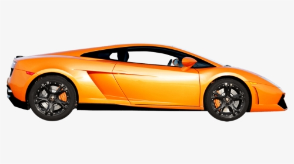

# opencv
Opencv projet

###############
This project is about extracting the color from any image.

###############

Input folder contains image of a car from which colour to be extracted.

Output folder contains stacked images which are produced during colour extraction.

##########
Prerequsites

python 
opencv

you have to adjust the trackbars position for optimal (HSV )Hue,Saturation and value for perfact colour mask.

then apply all HSV min. and max values to the mask.

IN main code there is a function for stacking images for better view in single display window.

  <figure>
   
   <figcaption>Original Image.</figcaption>
  </figure>
   
  <figure>
   
   <figcaption>Trackbar.</figcaption>
  </figure>
   
  <figure>
    
   <figcaption>HSV Image.</figcaption>
  </figure>
   
  <figure>
   
   <figcaption>Mask.</figcaption>
  </figure>
   
  <figure>
   
   <figcaption>Extracted color.</figcaption>
  </figure>
  
  
   <figure>
   
   <figcaption>stacked image.</figcaption>
  </figure>
  
  
  

