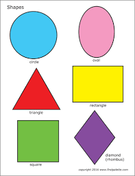
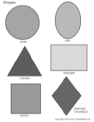
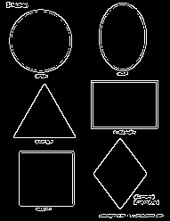
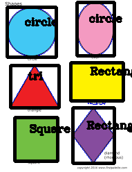
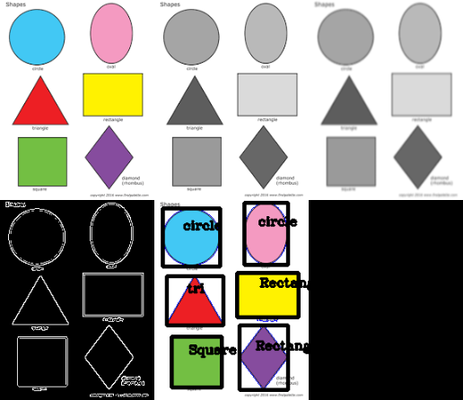

# opencv
Opencv projet

###############
This project is about extracting the Shapes from any image.

###############

Input folder contains image of a different shapes from which shape to be extracted.

Output folder contains stacked images and output images which are produced during contour detection.

##########
Prerequsites

python 
opencv

You can adjust the code according to the detected corners of objects to classify multidimentional shapes.
this project contains detection of following object shapes only :-
1.circle
2.rectangle
3.square.
4.triangle

  <figure>
   
   <figcaption>Original Image.</figcaption>
  </figure>
   
  <figure>
   
   <figcaption>Gray Transformed image.</figcaption>
  </figure>
   
  <figure>
    
   <figcaption>Blur Transformed image.</figcaption>
  </figure>
   
  <figure>
   
   <figcaption>Edge detection</figcaption>
  </figure>
   
  <figure>
   
   <figcaption>Extracted Object</figcaption>
  </figure>
  
  
   <figure>
   
   <figcaption>All in one stacked image.</figcaption>
  </figure>
  
  
  

