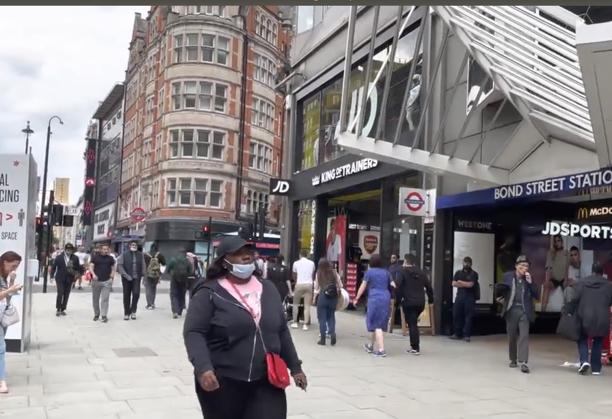
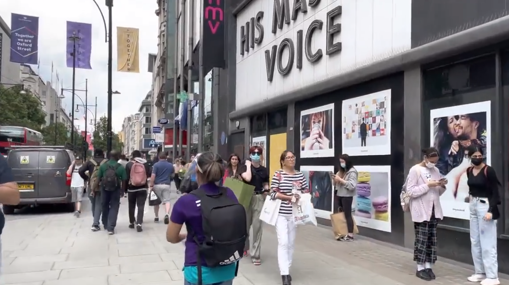
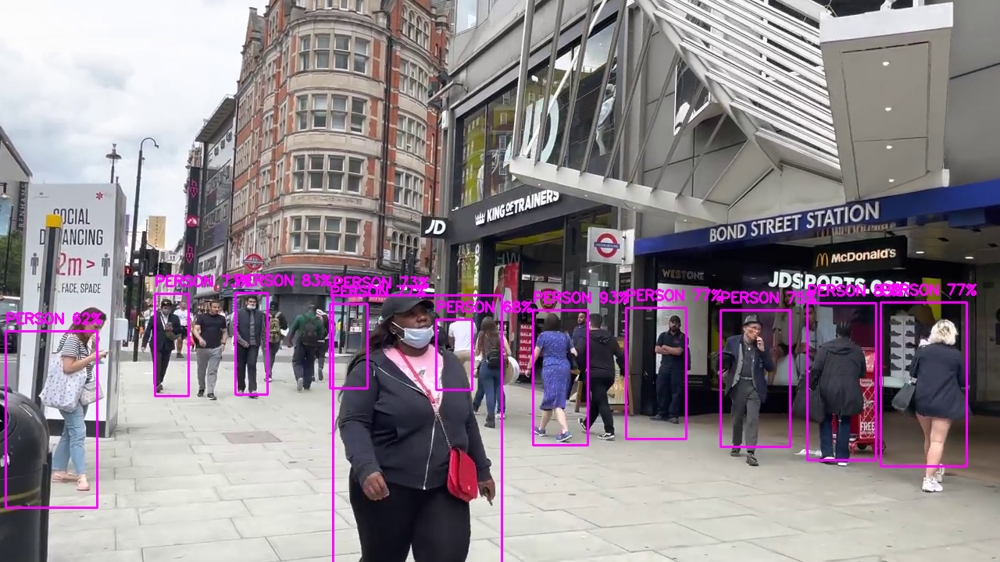
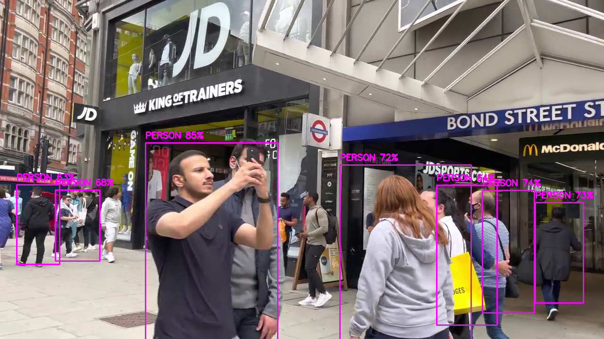
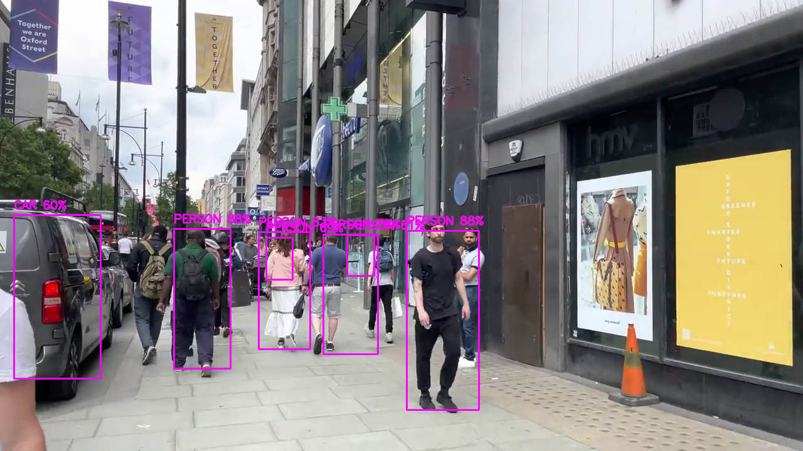

# opencv
Opencv projet

###############
This project is about detecting various object in a video feed listed in coco dataset
###############

Input folder contains  data of weights and configuration of trained nural network along with input video for detecting objects.
The nural network takes input file size of 320x320

there are weights and configuration file for 2 networks yolo_v3 and yolo_tiny.
yolo_tiny is faster and less accurate as compared with yolo_v3.

##########
Prerequsites

python 
opencv

Download yolo_v3 and yolo_tiny weights from  <a href='https://pjreddie.com/darknet/yolo/' > yolo weights and config files.</a>
<h2>OUTPUT:- </h2>
<h2>Original video screenshot </h2>

  <figure>
   
   
  
  </figure>
   <h2>Human detection in video frame. </h2>
  <figure>
   
 
  
  </figure>
   
<h2>Car and humans detection simultaneously. </h2>
   
  <figure>
   
  
  </figure>
   
 

